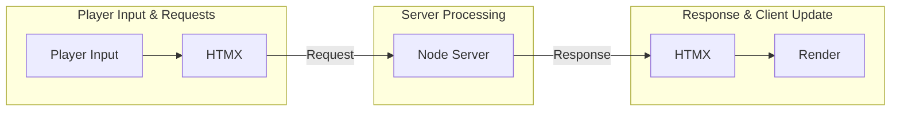
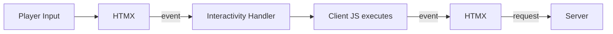
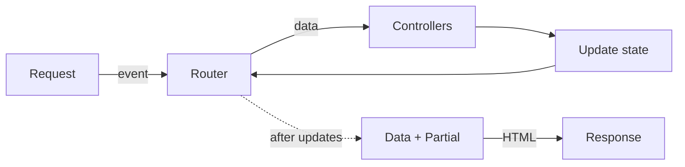

# Architecture Overview
A basic guide describing how the application works. The tech involved:
- [NodeJS](https://nodejs.org/en) server
- [Express](https://expressjs.com/) routing
- [EJS](https://ejs.co/) templates
- [HTMX](https://htmx.org/) client
- Vanilla JS
- [SCSS](https://sass-lang.com/) partials

A high level breakdown showing three major areas of the "core loop":

## Player Input & Requests
When a player clicks an element on the page, based on attributes assigned, HTMX sends a request to the server and expects an HTML payload back. This paradigm can make it tricky to _also_ execute any client-side JS. To solve for this, each HTMX interaction emits an event to a global JavaScript listener in the window.

Depending on the attributes in that event, the Interactivity handler will execute any GUI-related JS that needs to happen, like the typewriter effect or playing audio. When finished, it emits a response event back to a specified HTMX element (usually the one that emitted the original event), which triggers the server request.

## Server Processing
When the node server gets a request, it routes it through the Express router. In this app routes can almost be considered "actions" the player has taken. For example, the route `/scenes/shrine/takecandle` can be directly translated into "the player took the candle in the Shrine scene".

The Routes import Controllers. Controllers _do stuff_ like mutate state or transform data. In this paradigm, Routes act as a manifest of things to do, and Controllers go do those things. When they're all finished, the route delivers (in most cases) a payload consisting of Data + Template.

The templates, or partials, are mixed with whatever data the route provides and outputs plain HTML as the response back to the client.

## Response & Client Update
With an HTML response ready, HTMX will update any part(s) of the DOM with the new structure. This can, sometimes, trigger an HTMX `load` event to perform a successive request. Or, in most cases, the player will interact again to restart the loop.